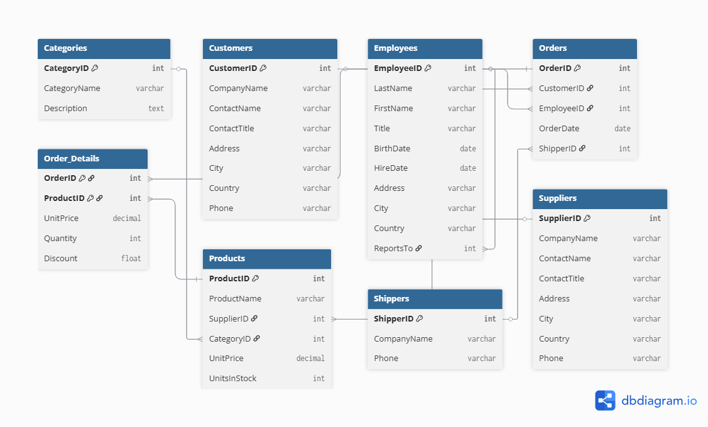

# ERD Kiwilytics Project

## 📌 Overview

This project presents an Entity-Relationship Diagram (ERD) for a full-scale e-commerce/order management system. The database is designed to handle customers, orders, products, suppliers, and shipping operations.

---

## 🧠 Database Design

### Categories

Stores product categories.

* CategoryID (PK)
* CategoryName
* Description

### Products

Stores product information.

* ProductID (PK)
* ProductName
* SupplierID (FK)
* CategoryID (FK)
* UnitPrice
* UnitsInStock

### Suppliers

Stores supplier details.

* SupplierID (PK)
* CompanyName
* ContactName
* ContactTitle
* Address, City, Country, Phone

### Customers

Stores customer data.

* CustomerID (PK)
* CompanyName
* ContactName
* Address, City, Country, Phone

### Employees

Stores employee data.

* EmployeeID (PK)
* FirstName, LastName
* Title
* ReportsTo (manager relationship)

### Orders

Stores order records.

* OrderID (PK)
* CustomerID (FK)
* EmployeeID (FK)
* OrderDate
* ShipperID (FK)

### Order Details

Links orders and products.

* OrderID (PK, FK)
* ProductID (PK, FK)
* UnitPrice
* Quantity
* Discount

### Shippers

Stores shipping companies.

* ShipperID (PK)
* CompanyName
* Phone

---

## 🔗 Relationships

* One customer → many orders
* One employee → many orders
* One shipper → many orders
* One order → many order details
* One product → many order details
* One category → many products
* One supplier → many products

---

## 🎯 Use Case

This database can be used for:

* E-commerce systems
* Sales tracking
* Inventory management
* Business analytics

---

## 🚀 Key Features

* Normalized database structure
* Clear relationships between entities
* Scalable for real-world applications

Suitable for e-commerce platforms and sales analysis.

